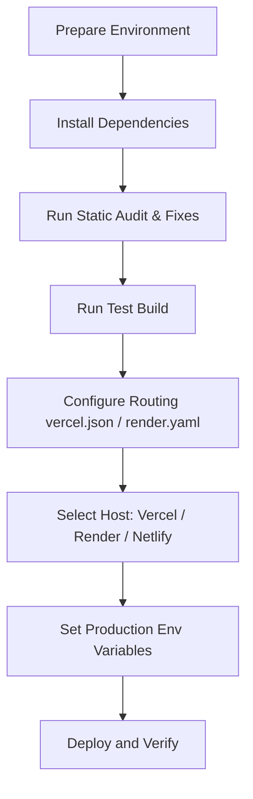

# Kisan Sarthi Deployment Plan & Technical Audit

This document provides a production deployment plan and readiness audit for the **Kisan Sarthi Satellite-Based Crop Intelligence Platform** based on the actual codebase.

---

## 1. Current Architecture Report

### Frontend
- **Framework**: React 19 (React `^19.2.6`, React-DOM `^19.2.6`)
- **Build Tool**: Vite `^8.0.12`
- **Routing**: Single Page Application (SPA) using React Router Dom v7 (`react-router-dom: ^7.17.0`)
- **State Management**: React state, custom hooks, and React Context (`AppContext.jsx` providing seed data context).
- **Animations**: Framer Motion (`framer-motion: ^12.40.0`)
- **Charts**: Recharts (`recharts: ^3.8.1`)

### Backend
- **Framework**: **None**. Kisan Sarthi is a pure frontend Single Page Application (SPA).
- **API Architecture**: Direct HTTPS client-to-API calls. The frontend performs standard `fetch` requests directly to Google Generative AI (Gemini) endpoints from the browser.

### Database
- **Primary Database**: **None**. All application states (plots, historical NDVI, market prices) are loaded from static, structured seed files (`src/data/seedData.js` and `src/data/schemes.json`).

### External APIs
- **AI Advisory & Schemes Guide**: Google Gemini API (`https://generativelanguage.googleapis.com`)
- **Map & Satellite Tiles**: Esri World Imagery (`https://server.arcgisonline.com`) and OpenStreetMap tile servers.
- **Legacy AI (Inactive)**: Anthropic Claude Messages API (`https://api.anthropic.com`)

### Required Environment Variables
- `VITE_GEMINI_API_KEY`: Google Gemini API access key (Required for diagnostics and scheme explanations).
- `VITE_GEMINI_MODEL`: The target AI model. Defaults to `gemini-3.5-flash`.
- `VITE_APP_VERSION`: App version metadata. Defaults to `2.0.0`.

---

## 2. Deployment Checklist

Follow these steps to deploy Kisan Sarthi from local development to production:



### Step 1: Prepare the Environment
Ensure your machine is running Node.js (v18+ recommended) and `npm`. Copy and review your environment file:
```bash
cp .env.example .env
```

### Step 2: Install Dependencies
Install exact package matches:
```bash
npm ci
```

### Step 3: Run Linter & Fix Standard Issues
Run the linter and clean up unused variables:
```bash
npm run lint
```

### Step 4: Perform a Production Test Build
Verify that compilation is successful and the build artifacts bundle correctly:
```bash
npm run build
```

### Step 5: Configure Hosting & Upload Code
Commit your changes, push to a remote git repository (GitHub/GitLab), and link it to your chosen deployment provider.

---

## 3. Vercel Deployment Guide

### Suitability
**Vercel is highly suitable for Kisan Sarthi.** Because Kisan Sarthi is a pure static frontend SPA, it can be hosted on Vercel's Edge CDN for free, resulting in fast global loading speeds and automated preview deployments.

### Configuration
- **Build Command**: `npm run build`
- **Output Directory**: `dist`
- **Vercel Routing File (`vercel.json`)**:
  ```json
  {
    "cleanUrls": true,
    "rewrites": [
      { "source": "/(.*)", "destination": "/index.html" }
    ]
  }
  ```
  *(This file is located at the root of the project to ensure client-side routes like `/farmer` and `/admin` do not result in 404s when accessed directly).*

### Environment Variables
Configure the following in the Vercel Project Settings -> Environment Variables:
- `VITE_GEMINI_API_KEY`: *(Your secure Google Gemini API key)*
- `VITE_GEMINI_MODEL`: `gemini-3.5-flash`
- `VITE_APP_VERSION`: `2.0.0`

---

## 4. Render Deployment Guide

### Suitability
Render is suitable for hosting Kisan Sarthi as a **Static Site**.

### Configuration (`render.yaml`)
Create or use the `render.yaml` file in your root folder:
```yaml
services:
  - type: web
    name: Kisan Sarthi
    env: static
    buildCommand: npm run build
    publishPath: dist
    headers:
      - path: /*
        name: Cache-Control
        value: max-age=31536000
    routes:
      - src: /*
        dest: /index.html
```

### Build Details
- **Build Command**: `npm run build`
- **Publish Directory**: `dist`

### Environment Variables
Set these variables in the Render Dashboard under your service's Environment settings:
- `VITE_GEMINI_API_KEY`: *(Your Google Gemini API key)*
- `VITE_GEMINI_MODEL`: `gemini-3.5-flash`

---

## 5. Database Roadmap

Currently, Kisan Sarthi has **no database**. The app reads from static arrays inside `src/data/seedData.js`. 

### Production Database Recommendation
For a production deployment, migrate from seed files to a backend-driven database.
- **Database Choice**: PostgreSQL (hosted on Render, Supabase, or AWS RDS).
- **ORMs/Query Builders**: Prisma or Drizzle ORM to manage schemas and migrations.
- **Key Tables to Implement**:
  - `users`: Farmer/Admin authentication details, language preference.
  - `plots`: Lat/Lon boundaries, acreage, crop type, and soil telemetry scores.
  - `advisories`: Cached historical AI advisories linked to plots.

### Migration & Seeding Steps
1. Create database schemas reflecting the structure of `seedData.js`.
2. Write a Node.js seed script (`seed.js`) that imports `src/data/seedData.js` and inserts them into your PostgreSQL database using Prisma/Drizzle.
3. Replace direct imports of `D` with fetch requests to your backend endpoints (e.g., `fetch('/api/plots')`).

---

## 6. API Keys & Configurations

Configure the following API keys in your hosting provider's dashboard:

| Provider/Service | Variable Name | Purpose | Configuration Location |
| :--- | :--- | :--- | :--- |
| **Google Gemini** | `VITE_GEMINI_API_KEY` | Generates crop diagnostics & scheme guidance | Vercel Env Settings / `.env` |
| **Maps & Satellite** | *None* | Uses public Esri tile servers | Hardcoded in `FieldHealthMap.jsx` |
| **Weather** | *None* | Currently static; ready for Open-Meteo | Ready in `climateService.js` |
| **Government Schemes** | *None* | Programmatic eligibility logic | Hardcoded client-side in `schemesService.js` |
| **Market Data** | *None* | Currently static; ready for Mandi APIs | Ready in `marketService.js` |

---

## 7. Production Readiness & Security Audit

> [!WARNING]
> ### Critical Security Vulnerability: Frontend API Key Exposure
> Vite embeds all variables prefixed with `VITE_` directly into the public Javascript bundle. In our audit, we identified that `VITE_GEMINI_API_KEY` is loaded client-side via `import.meta.env.VITE_GEMINI_API_KEY` and sent directly to Google.
> 
> **Implication**: Any user can open the browser console, inspect the Javascript assets, or look at the Network requests to steal your Gemini API Key.
> 
> **Immediate Mitigations**:
> 1. Go to [Google AI Studio Console](https://aistudio.google.com/) and restrict your API key to prevent misuse (restrict by HTTP Referrer, restricting to specific domain).
> 2. **Best Practice Recommendation**: Create a simple serverless function or backend proxy (e.g. Next.js API route or Express proxy) that appends the API key on the server-side, protecting it from client-side visibility.

### Hardcoded Secrets Audit
- **Findings**: The local development `.env` contains a Gemini API Key. Ensure that `.env` is listed in `.gitignore` to prevent pushing it to GitHub. (Our audit shows `.gitignore` successfully excludes `.env`). No other hardcoded keys exist in the codebase.

### Mobile Responsiveness
- The Farmer dashboard is designed specifically as a mobile viewport (`max-width: 430px; margin: 0 auto;`).
- Bottom navigation and slide-up trays are aligned absolutely inside `.farmer-shell` to ensure they render correctly without horizontal scrolling on small viewports.

### Lint & Build Audits
- **Build Status**: Successful (`npm run build` completes cleanly, outputting to `/dist` in `1.1s`).
- **Lint Status**: 57 lint warnings/errors remain, primarily unused imports (`no-unused-vars`) and a custom `set-state-in-effect` warning. These warnings do not block the compilation but should be cleaned up for optimal production bundle size.
- **ESM Config Warning**: `vite.config.js` has a reference to `__dirname`, which is not available in ES Modules (`type: "module"` in `package.json`).
  - *Fix*: Update `vite.config.js` to resolve path alias using standard ESM patterns or Node's `import.meta.dirname`.
